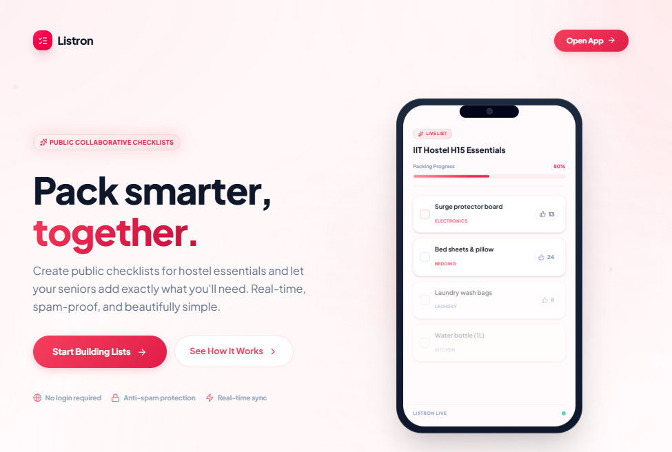

# Listron

A premium, collaborative platform where incoming college students and seniors build public, shareable packing checklists with rate-limited anti-spam security.

## Features

- **Public Checklists**: Share packing lists via a simple link.
- **Name-Based Login Gate**: Users enter their name to access and contribute to a list.
- **Per-User Progress Tracking**: Packing progress is tracked individually per user across devices via Firebase Realtime Database.
- **Anti-Spam Security**: Built-in rate limiting with doubling cooldowns to prevent spamming items.
- **Modern UI/UX**: Premium glassmorphism design, animated elements, and responsive mobile-first layout.
- **Real-Time Sync**: Additions, upvotes, and member joins sync instantly.

## Tech Stack

- Next.js (App Router)
- Tailwind CSS
- Firebase Realtime Database

## Credits

- Vibe coded by **shadowXg**
- Author: **MangalNathYadav**
- Used IDE: **antigravity**
- Used agent: **gemini 3.5 flash (low) time limited**
